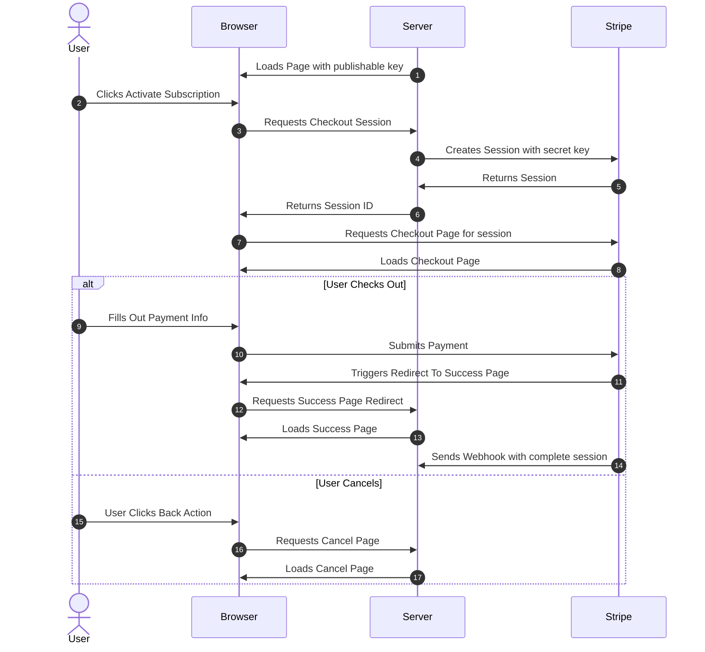

# Accounts

Here is the activation flow.

```mermaid
sequenceDiagram
    autonumber
    actor User
    participant Browser
    participant Server
    participant Stripe
    Server->>Browser: Loads Page with publishable key
    User->>Browser: Clicks Activate Subscription
    Browser->>Server: Requests Checkout Session
    Server->>Stripe: Creates Session with secret key
    Stripe->>Server: Returns Session
    Server->>Browser: Returns Session ID
    Browser->>Stripe: Requests Checkout Page for session
    Stripe->>Browser: Loads Checkout Page
    alt User Checks Out
        User->>Browser: Fills Out Payment Info
        Browser->>Stripe: Submits Payment
        Stripe->>Browser: Triggers Redirect To Success Page
        Browser->>Server: Requests Success Page Redirect
        Server->>Browser: Loads Success Page
        Stripe->>Server: Sends Webhook with complete session
    else User Cancels
        User->>Browser: User Clicks Back Action
        Browser->>Server: Requests Cancel Page
        Server->>Browser: Loads Cancel Page
    end
```
